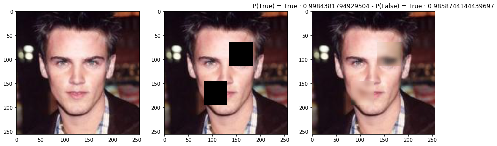
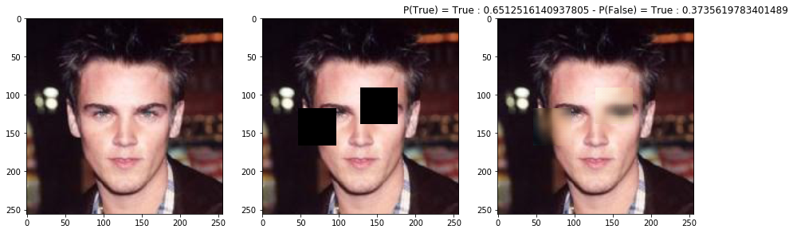
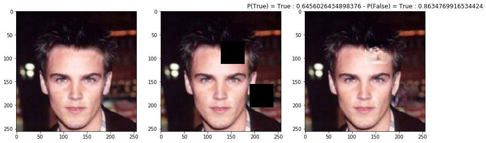
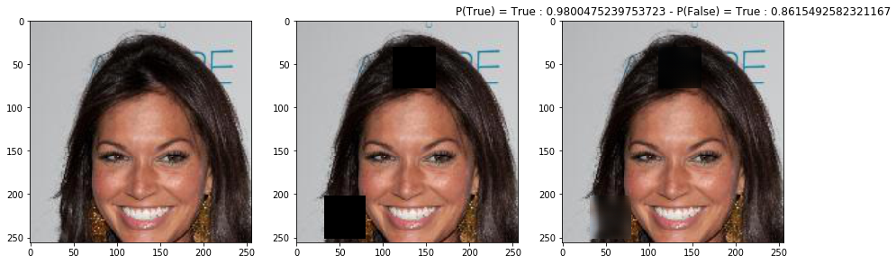
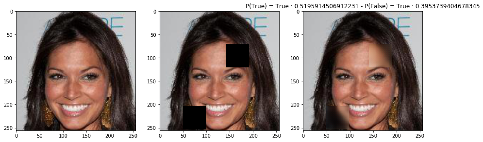
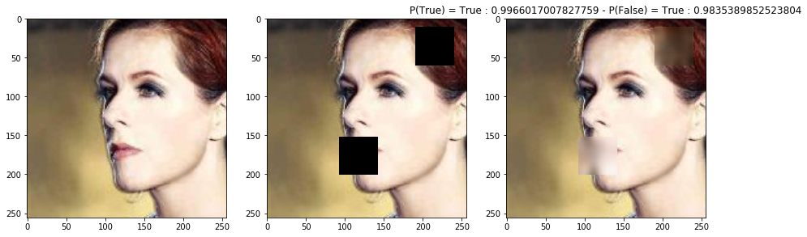
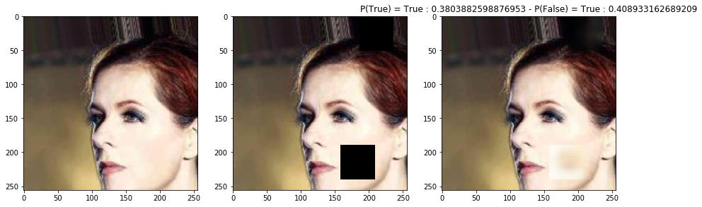
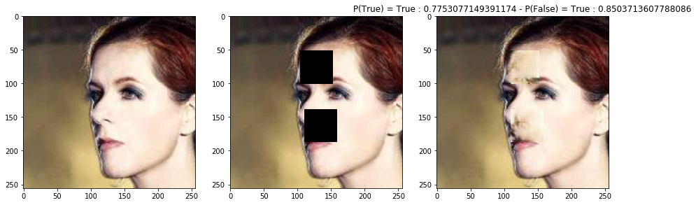
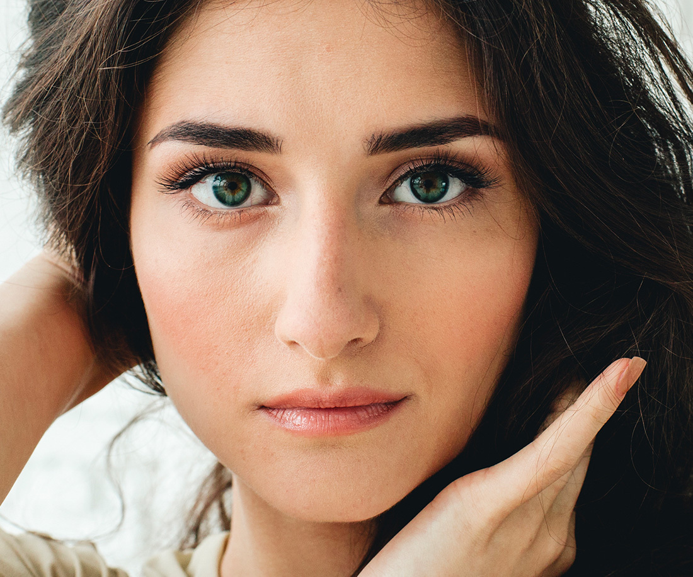

# Globally-and-Locally-Consistent-Image-Completion-Pytorch-Implementation
Implementation of the Globally and Locally Consistent Image Completion [paper](http://dx.doi.org/10.1145/3072959.3073659) in Pytorch, on the [CelebA](https://mmlab.ie.cuhk.edu.hk/projects/CelebA.html) Dataset

## Configuration
### OS requirements: 

Basically any provided you manage to do the other steps of the configuration.

### Hardware requirements:

The main constraints are on the GPU because most of the calcultation happens there. The code is tailored to run on GPU and on CPU, but if you want to do any training, it is highly recommended to use a GPU.

- You will need a NVIDIA GPU that is CUDA-enabled (view this [list](https://developer.nvidia.com/cuda-gpus)). Should have at least 4 GB in dedicated memory for inference, but for training, it is better to have 16 GB or more.


### Installation

The installation is a long and tidy process due to the many different libraries and plug-ins. It is very important to respect the installation order and the versions as many libraries have precise dependencies.

- Install python >= 3.8
- (For GPU usage) Install CUDA Toolkit 11.4.1 with the [official documentation](https://docs.nvidia.com/cuda/archive/11.4.1/). If not supported on the machine, opt for CUDA Toolkit 10.2 with the [docs](https://docs.nvidia.com/cuda/archive/10.2/).
- Install the python libraries in the requirement.txt file (preferably using a [virtual environement](https://docs.python.org/3.8/library/venv.html)), for example with pip:
```sh
pip install --upgrade pip
pip install -r requirements.txt
```
- Install PyTorch 1.10 according to your OS and CUDA Toolkit version on the [official website](https://pytorch.org/).
- (For GPU) Install [cuDNN 8.2.4](https://docs.nvidia.com/deeplearning/cudnn/archives/cudnn-824/install-guide/index.html) for [CUDA 11.4](https://developer.nvidia.com/rdp/cudnn-archive#a-collapse824-114) or [CUDA 10.2](https://developer.nvidia.com/rdp/cudnn-archive#a-collapse824-102).

To check if the installation is correct, open a python prompt and try the following commands:

```python
import torch

print(torch.cuda.is_available()) # Should ouput True.
print(torch.__version__) # Should output '1.10.0+cu113' or '1.10.0+cu102'
```

Note that these are necessary checks but not sufficient ones.


## Example results

You can see more results in the [results](/results) directory.

For each next three examples, the images were produced at three different step of the training:

- End of training for the Completion network being trained alone.
- Mid-training for the Completion network being trained with the Discriminator.
- End of training for the Completion network being trained with the Discriminator.















## Organization of this directory

This project has four main components: 4 .py files and an .ipynb notebook:
- [models.py](scripts/models.py) contains two classes defining the completion and discrimination networks;
- [utils.py](scripts/utils.py) contains all the side functions that we needed to perform various tasks;
- [trainers.py](scripts/trainers.py) contains the implementation of the three training algorithms used to train the GAN;
- [inference.py](scripts/inference.py) contains a code snippet that performs inference, and save some images in the saves/figures directory;
- [MODAL_INF473_Retourne_Counathe.ipynb](notebook/MODAL_INF473_Retourne_Counathe.ipynb) is the notebook where all these previous functions and classess are used in order to create a GAN, train it, and assess its performances. For convenience purpose, and to make the project interactive and playful we chose to keep this step in a notebook.

## Data

We trained two models using two different datasets : [CelebA](https://mmlab.ie.cuhk.edu.hk/projects/CelebA.html) and [Places](http://places2.csail.mit.edu/).

## Training

To train your own model, use the [trainers.py](trainers.py) script bu typing:


```sh
python trainers.py
```

It will instantiate a Completion and Discriminator network randomly, and then train both for a few epochs, using the three different techniques.

You might want to change the training hyperparameters, such as the number of epochs, and of course the training set.

To do so, just alter then end of the script: 

```python
train_set = torchvision.datasets.CIFAR10(root="./data", transform=transform, train=True, download=True)
test_set = torchvision.datasets.CIFAR10(root="./data", transform=transform, train=False, download=True)
dataset_with_labels = True
test_loader = torch.utils.data.DataLoader(test_set)
```

```python
train_C(
    model_c,
    opt_c,
    train_set,
    train_acc_period=100,
    n_epoch=5,
    save_period=1,
    batch_size=2,
    num_samples=1000,
    device=device,
    dataset_with_labels=dataset_with_labels,
    pixel=mean_pixel,
)
```

## Testing

If you want to test your model (or our pre-trained ones), you should use the [inference.py](inference.py) scripts.

After changing paths to load your model properly (and hyperparameters), just run:

```sh
python inference.py
```


```python
# Generate recompleted images.
test_and_compare(
    model_c=model_c,
    model_d=model_d,
    test_loader=test_loader,
    number_of_pictures=5,
    h_range_mask=(48, 50),
    w_range_mask=(48, 50),
    num_holes=2,
    p=0.01,
    dataset_with_labels=dataset_with_labels,
    device=device,
    pixel=mean_pixel,
)
```

To test our weights on more images, just add them in [test/img](test/img) directory.




Results will be saved in the saves/figures directory.
